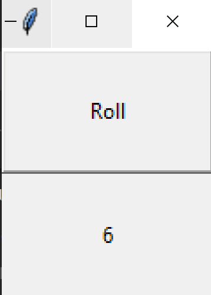
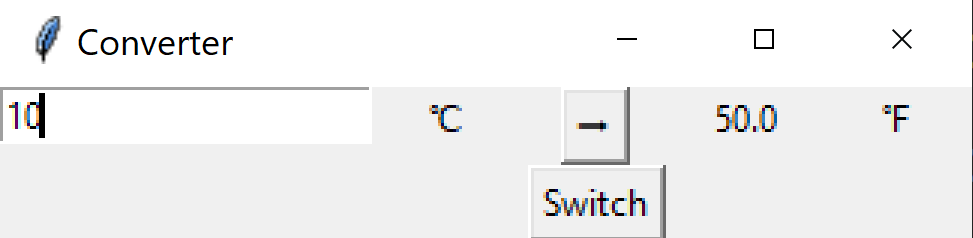
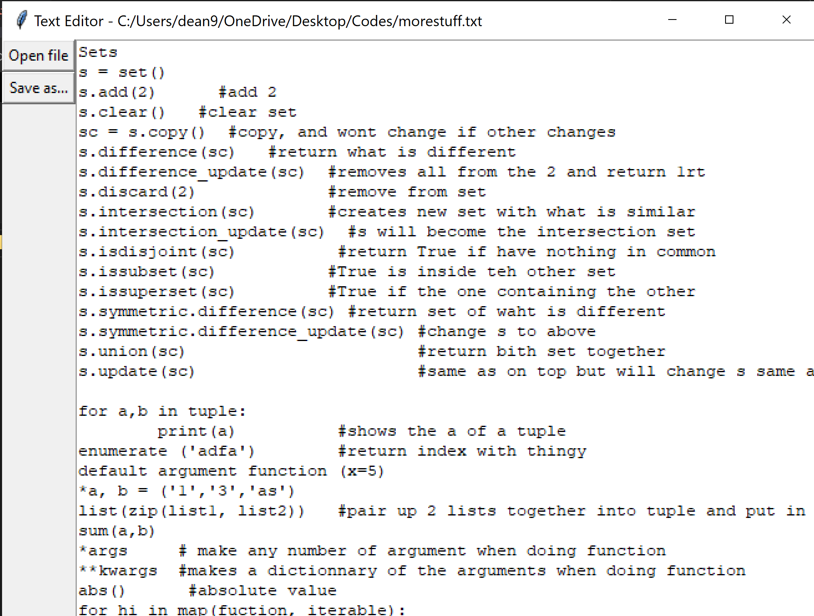

# Tkinter-GUI-Basic-Exercise

# Tkinter Mini Projects

This repository contains three standalone projects built using Python's `Tkinter` library. Each project demonstrates a specific concept and functionality, showcasing the versatility of `Tkinter` for building GUI applications.

## Table of Contents
1. [Dice Roller](#dice-roller)
2. [Temperature Converter](#temperature-converter)
3. [Text Editor](#text-editor)

---

## Dice Roller

### Overview
A fun and minimalistic dice roller application. Features include:
- A single button to "roll the dice."
- Displays a random number between 1 and 6, simulating a dice roll.

### Screenshot

---

## Temperature Converter

### Overview
A simple GUI application to convert temperatures between Celsius and Fahrenheit and reverse. It features:
- Easy input of temperature values.
- Conversion between Celsius and Fahrenheit with a single click.
- A button to switch the conversion mode.

### Screenshot

---

## Text Editor

### Overview
A basic text editor with file-handling capabilities. Key features:
- Open and edit files directly from the GUI.
- Save files with a customizable filename and location.
- A clean and responsive interface for editing text.

### Screenshot

